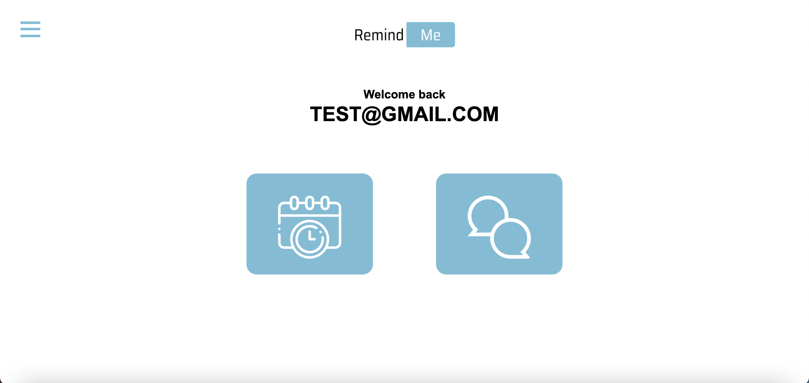
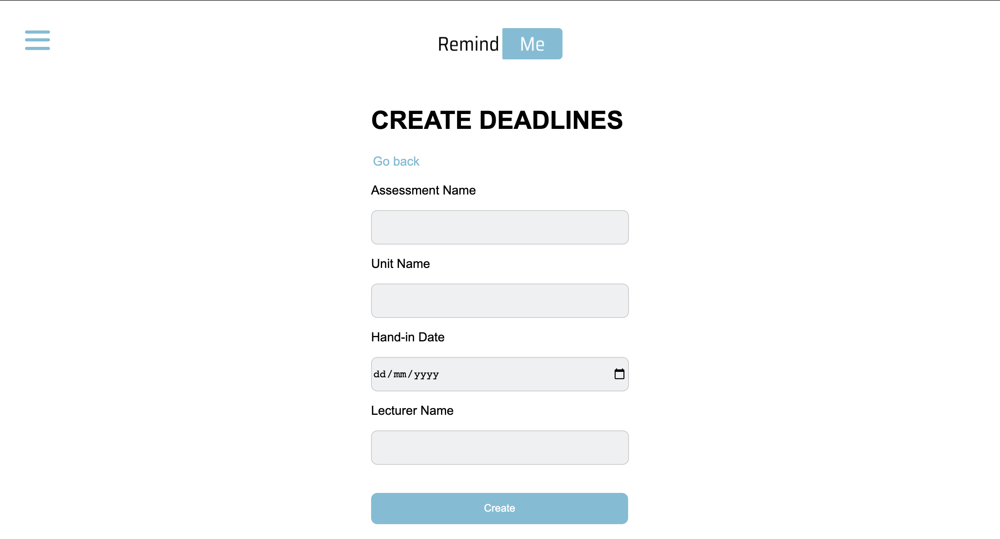

# Remind Me

## Table of contents

- [Introduction](#Introduction)
- [Methodology](#Methodology)
- [Conclusion/ Results](#Conclusion)

## Introduction

Good time management is a core skill that students must develop to succeed in life. It involves being able to manage their work-life balance while still staying productive.
Being able to manage time effectively can help students succeed academically. Having a good time perspective can also help students avoid getting bogged down by their work and feel annoyed when they finish a course. Having a productive work environment can also help students feel more productive. However, tools that help people manage their time are also helpful.

Time management is a skill that people can use to improve their lives. According to Aduke (2015), it is a process that involves planning and organizing one's time to create more efficient work. It is a set of strategies and actions that help individuals achieve goals.

This document focuses on the last phase of the design thinking process, the Prototype and the Test phase. It will discuss the methodology, which explains the specific procedures or techniques used to identify, select, process, and analyze information about a topic. In a research paper, the methodology section allows the reader to evaluate a study's overall validity and reliability critically. 

The results section report will discuss the development of the program and the finding of the study based upon the methodology or methodologies used to gather information. The results section will state the findings of the research.

The Last topic is the conclusion, where the developer will conclude what he obtained with this project, explain the difficulties he faced during the process, and suggest changes that can be made on future versions.

## Methodology

This section will explain the various methodologies used to gather data and analyse the relevant data used in the research. The methodologies will contain areas such as the location of the study and tools used to develop the program.

### Location of study

The study was carried out in the Southampton area, specifically in the Solent university. The survey was sent to the students to understand better how the students deal with time management. The objective is for future versions to study other universities to know where it will solve the universities' problems.

### Sotfwares used

#### 1. Github

GitHub is a website where developers and programmers may collaborate on code. The fundamental advantage of GitHub is its version control system, which enables for seamless collaboration without jeopardizing the original project's integrity.

The repository was created with the name of "COM623_Project" in private, but after being changed to the public to be accessed to check the code developed and accessed the project on the GitHub pages.

#### 2. Firebase

Google Firebase is a Google-backed app development platform that allows developers to create iOS, Android, and Web apps. Firebase offers tools for tracking statistics, reporting and resolving app errors, as well as executing marketing and product experiments.

This project created a database named remind-me where it will contain all the user information and their data, such as deadlines and discussion chats with their lecturers.

Firebase gives multiple ways to the developers to allow users to log in, but in this project, it only allows the users to log in with their email. 

## 	Program Development

The program was developed with react native, and it is possible to observe the structure in figure 1.

    

 (Figure 1)
 

When the student is on the landing page, it will have a short description of the purpose of the application and a register and a login button (figure 2).

    

 (Figure 2)
 

If the user clicks on the register, it will send to a page asking for an email and a password. After checking, it will automatically send to the main page, and if you click on the login button, it will ask for an email and a password and send it to the main page (figure 3, figure 4).

    

 (Figure 3)
 

 

    

 (Figure 4)
 

When the user enters the Main Page, it will show two options, Deadlines and Discussion. They can be accessed on the hamburger menu located on the top left. On the hamburger menu, an option to log out (figure 5).

    

 (Figure 5)
 

 
On the Deadlines Page, it will display the deadlines created by the user containing the unit name in first, the date on the middle, and the lecturer's name after. The user can create a deadline by clicking "create deadline" (figure 6).

    

 (Figure 6)
 

On the create deadlines page, the program will ask for details such as assessment name, the unit name, the hand in date, and the lecturer name (figure 7). 

    

 (Figure 7)
 

 
Discussion Page allows the user to chat with his lecturers about a question on current assessments. The boxes are organized in a way that is easier for the user to check quick the conversation that he wants to enter. The information shown on the boxes highlights the lecturer name. It shows the date where the chat was created, under the lecturer name shows the unit name and under the unit name is the discussion topic. 

The boxes were designed this way to allow the lecturers to have a quick perception after seeing the box. It allows for an immediate answer/response system (figure 8).

    

 (Figure 8)
 

 

If the student has a new assessment and a question, it can create a new chat by clicking on the "create a new discussion" option.

On the create discussion page, the program will ask for important information such as the question topic, the unit name, and lecturer name to look on the database for that lecturer and send him a notification about the new chat creation and the date. Still, its field can't be edited (figure 9).

    

 (Figure 9)
 

 

## Conclusion

In the final analysis, this project has challenged users in different areas. The program does not have all the actions discussed in the first part of the assessment. Still, for the next version, the developer wants to implement a way that allows the user to log in or register using other methods than email and password. In this case, it would be by using social media for quick access.

The program has a few errors in database management because the messages or the deadlines are not associated with a specific user, which means any user can see the information.

Due to the limit of time, the developer didn't have the opportunity to obtain the knowledge to implement other functions on the deadlines page. The main objective was to implement multiple types of interaction with the deadlines besides creating a new one. For the following versions, the user wants to implement edit and delete functionality to allow the user to have full accessibility and organize his deadlines.

As mentioned above, the constraints that the developed had, did not allow implementing all the functionalities on the Discussions page, referring to a delete option, allowing the user to delete a chat that he already has the answer for his question.

One of the main objectives of the application was to implement a way that when the user or the lecturer sends a message, the user person can receive and notification. Still, it could not because of knowledge and time limitation. But for the next version is a solid point to be added to the application.

On the chat page, for the next version, the developer wants to implement an option that can allow the user to send attachments and that file be stored on the database so it can be accessed when the user or the lecturer wants.
